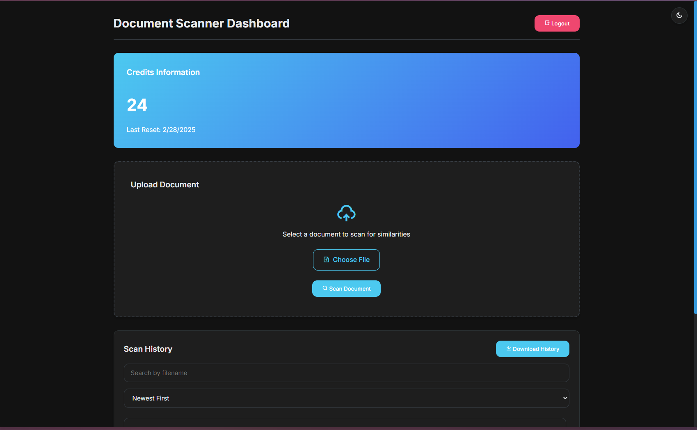
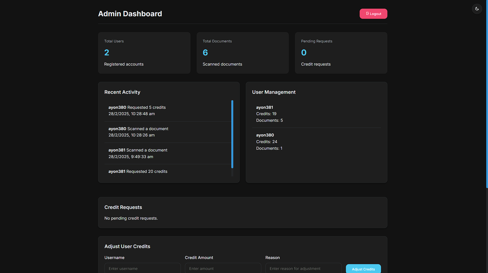

# Carthago Document Scanner

Carthago is a document scanning and similarity comparison application that allows users to upload and analyze documents.

## Screenshots

### User Page



### Admin Page



## Prerequisites

Before you begin, ensure you have met the following requirements:
- You have installed the latest version of [Node.js](https://nodejs.org/).
- You have a compatible operating system (Windows, macOS, or Linux).
- You have a package manager like npm or yarn installed.

## Installation

To install Carthago, follow these steps:

1. Clone the repository:
    ```sh
    git clone https://github.com/ayon380/carthago.git
    ```
2. Navigate to the project directory:
    ```sh
    cd Carthago/backend
    ```
3. Install the dependencies:
    ```sh
    npm install
    ```

## Usage

To start using Carthago, follow these steps:

1. Start the development server:
    ```sh
    nodemon app.js
    ```
2. Now Start the HTML pages using live server.


## API Documentation

### Authentication Endpoints

#### Register a new user
```
POST /auth/register
```
**Request Body:**
```json
{
  "username": "string",
  "password": "string"
}
```
**Response:**
```json
{
  "token": "JWT_TOKEN"
}
```

#### Login
```
POST /auth/login
```
**Request Body:**
```json
{
  "username": "string",
  "password": "string"
}
```
**Response:**
```json
{
  "token": "JWT_TOKEN"
}
```

### User Endpoints

#### Get user profile
```
GET /user/profile
```
**Headers:**
```
Authorization: Bearer JWT_TOKEN
```
**Response:**
```json
{
  "id": "number",
  "username": "string",
  "role": "string",
  "credits": "number",
  "last_reset": "date"
}
```

#### Scan a document
```
POST /scan
```
**Headers:**
```
Authorization: Bearer JWT_TOKEN
Content-Type: multipart/form-data
```
**Form Data:**
```
document: File
```
**Response:**
```json
{
  "message": "Document scanned successfully",
  "documentId": "number",
  "similarDocuments": [
    {
      "id": "number",
      "filename": "string",
      "similarity": "string"
    }
  ]
}
```

#### Get scan history
```
GET /user/scan-history
```
**Headers:**
```
Authorization: Bearer JWT_TOKEN
```
**Response:**
```json
{
  "scans": [
    {
      "id": "number",
      "filename": "string",
      "upload_date": "string",
      "formatted_date": "string",
      "scan_number": "number"
    }
  ]
}
```

#### Download scan history
```
GET /user/scan-history/download
```
**Headers:**
```
Authorization: Bearer JWT_TOKEN
```
**Response:**
A text file containing the scan history.

#### Get specific scan details
```
GET /user/scan/:scanId
```
**Headers:**
```
Authorization: Bearer JWT_TOKEN
```
**Response:**
```json
{
  "scan": {
    "id": "number",
    "user_id": "number",
    "filename": "string",
    "content": "string",
    "upload_date": "string",
    "formatted_date": "string"
  },
  "similar_documents": [
    {
      "id": "number",
      "filename": "string",
      "upload_date": "string",
      "similarity": "string"
    }
  ]
}
```

#### Request more credits
```
POST /credits/request
```
**Headers:**
```
Authorization: Bearer JWT_TOKEN
```
**Request Body:**
```json
{
  "amount": "number"
}
```
**Response:**
```json
{
  "message": "Credit request submitted successfully",
  "requestId": "number"
}
```

### Admin Endpoints

#### Get analytics
```
GET /admin/analytics
```
**Headers:**
```
Authorization: Bearer JWT_TOKEN
```
**Response:**
```json
{
  "totalUsers": "number",
  "totalDocuments": "number",
  "pendingRequests": "number"
}
```

#### Get all pending credit requests
```
GET /admin/credits/requests
```
**Headers:**
```
Authorization: Bearer JWT_TOKEN
```
**Response:**
```json
{
  "requests": [
    {
      "id": "number",
      "user_id": "number",
      "username": "string",
      "amount": "number",
      "status": "string",
      "request_date": "string"
    }
  ]
}
```

#### Approve credit request
```
POST /admin/credits/approve/:requestId
```
**Headers:**
```
Authorization: Bearer JWT_TOKEN
```
**Response:**
```json
{
  "message": "Credit request approved successfully"
}
```

#### Deny credit request
```
POST /admin/credits/deny/:requestId
```
**Headers:**
```
Authorization: Bearer JWT_TOKEN
```
**Response:**
```json
{
  "message": "Credit request denied successfully"
}
```

#### Get scans per user
```
GET /admin/analytics/scans-per-user
```
**Headers:**
```
Authorization: Bearer JWT_TOKEN
```
**Response:**
```json
{
  "scansPerUser": [
    {
      "user_id": "number",
      "scan_count": "number",
      "scan_date": "string"
    }
  ]
}
```

#### Get common topics
```
GET /admin/analytics/common-topics
```
**Headers:**
```
Authorization: Bearer JWT_TOKEN
```
**Response:**
```json
{
  "commonTopics": {
    "topic1": "number",
    "topic2": "number"
  }
}
```

#### Get top users
```
GET /admin/analytics/top-users
```
**Headers:**
```
Authorization: Bearer JWT_TOKEN
```
**Response:**
```json
{
  "topUsers": [
    {
      "username": "string",
      "scan_count": "number",
      "credits": "number"
    }
  ]
}
```

#### Get credit usage statistics
```
GET /admin/analytics/credit-usage
```
**Headers:**
```
Authorization: Bearer JWT_TOKEN
```
**Response:**
```json
{
  "creditUsage": [
    {
      "username": "string",
      "credits": "number",
      "credit_requests": "number"
    }
  ]
}
```

#### Adjust user credits
```
POST /admin/credits/adjust
```
**Headers:**
```
Authorization: Bearer JWT_TOKEN
```
**Request Body:**
```json
{
  "username": "string",
  "amount": "number",
  "reason": "string"
}
```
**Response:**
```json
{
  "message": "Credit balance adjusted successfully",
  "newBalance": "number"
}
```

#### Get user activity logs
```
GET /admin/activity-logs
```
**Headers:**
```
Authorization: Bearer JWT_TOKEN
```
**Response:**
```json
{
  "logs": [
    {
      "id": "number",
      "user_id": "number",
      "username": "string",
      "activity": "string",
      "timestamp": "string"
    }
  ]
}
```

## Error Responses

All endpoints may return the following error responses:

### 400 Bad Request
```json
{
  "error": "Error message describing the issue"
}
```

### 401 Unauthorized
```json
{
  "error": "Access denied"
}
```

### 403 Forbidden
```json
{
  "error": "Invalid token" or "Admin access required"
}
```

### 404 Not Found
```json
{
  "error": "Resource not found"
}
```

### 500 Server Error
```json
{
  "error": "Database error" or "Server error"
}
```

## Authentication

The API uses JWT (JSON Web Tokens) for authentication. After registration or login, the client receives a token that must be included in the Authorization header for subsequent requests:

```
Authorization: Bearer YOUR_JWT_TOKEN
```

